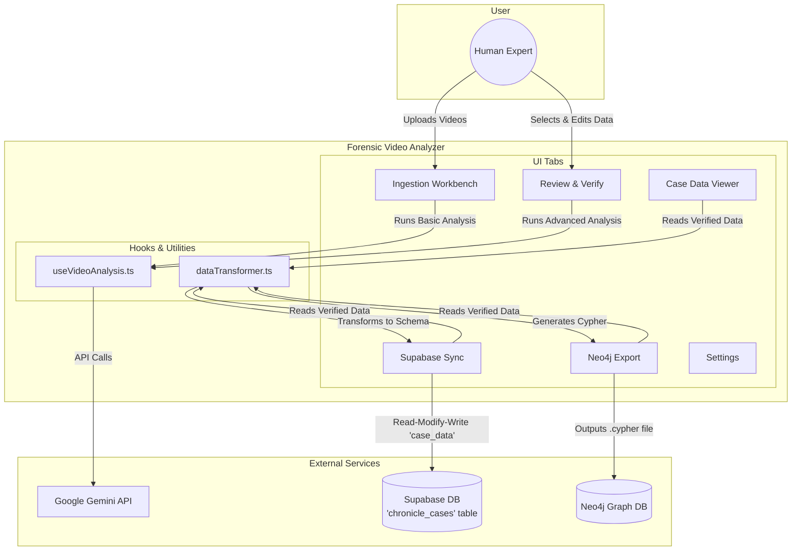

# Forensic Video Analyzer - Architecture & Integration Specification

## 1. Project Overview

The **Forensic Video Analyzer** is a client-side web application designed for the detailed analysis of video evidence. It serves as a specialized "Forensic Processor" within a larger data ecosystem, conforming to the data schema of the "Chronicle" application suite.

Its primary purpose is to ingest video files, facilitate a multi-stage AI-assisted analysis, and produce structured data that can be synchronized with a central `chronicle_cases` database on Supabase.

---

## 2. Core Philosophy & Workflow

The application is built around a professional, human-in-the-loop workflow that ensures data accuracy and depth of analysis. This workflow consists of three distinct stages:

1.  **Stage 1: Ingest & Basic Analysis (`Ingestion Workbench`)**
    *   **Goal:** Rapidly process raw video files into structured, but unverified, data.
    *   **Process:** The user uploads local videos or provides cloud URLs. A "naive" AI model (fast, low-cost) performs a surface-level analysis, capturing the *projected facade* of emotions, a literal summary, and a raw transcript.
    *   **Output:** A `StagedVideo` object with `status: 'Analyzed'`.

2.  **Stage 2: Human Review & Verification (`Review & Verify` Tab)**
    *   **Goal:** Allow a human expert to correct, contextualize, and approve the AI's initial draft.
    *   **Process:** The user scrubs through the video, edits the transcript, corrects entity names, and adjusts event details (description, significance, location, etc.). This is the critical quality control step.
    *   **Output:** The `StagedVideo` object's `status` is updated to `'Verified'`.

3.  **Stage 3: Advanced Forensic Analysis (`Review & Verify` Tab)**
    *   **Goal:** Use a powerful AI model to perform a deep, psychological analysis on the *human-verified* data.
    *   **Process:** After a video is `Verified`, the user can trigger the advanced analysis. A "smarter" AI model is given the verified context and the initial "naive" sentiment, and is specifically tasked with identifying inconsistencies, deception, and manipulation tactics.
    *   **Output:** The `forensicAnalysis` object within the `StagedVideo` is populated with a deception score, true sentiment, and other deep insights.

Only `Verified` data, which has passed through all three stages, is used for final data synchronization and export.

---

## 3. Visual Architecture Diagram (Mermaid.js)

This diagram describes the physical relationship between the application's components and external services.



---

## 4. Data Integration Specification

This is the master specification for any application interacting with the `chronicle_cases` database.

### A. The Single Source of Truth

*   **Provider:** Supabase (PostgreSQL)
*   **Table:** `chronicle_cases`
*   **Primary Data Column:** `case_data` (Type: `JSONB`)
*   **Primary Key:** `id` (UUID, representing a unique case)

### B. The "Read-Modify-Write" Mandate

To prevent data corruption, any application (including this one and the future Chat Transcript Analyzer) **MUST** follow this procedure for updates:

1.  **FETCH** the entire `case_data` JSON object for a given `case_id`.
2.  **MODIFY** the JSON object in memory by adding, removing, or updating items within its arrays (e.g., appending new `TimelineEvent` objects).
3.  **WRITE** the **entire, modified** `case_data` JSON object back to the same row.

**WARNING:** Do not perform partial JSON updates. This will overwrite and destroy data managed by other applications in the ecosystem.

### C. Shared Data Schemas (The "Hand-Off Packet")

Any data written to the `case_data` object **MUST** conform to these TypeScript interfaces.

#### `TimelineEvent` (The atomic unit of an event)
```typescript
interface TimelineEvent {
  id: string;             // UUID
  date: string;           // ISO 8601 String
  description: string;    // User-verified narrative of the event
  category: string;       // e.g., 'Current Case Incident'
  location: string;       // User-verified location
  witnesses: string[];    // Array of verified entity names
  involvedEntities: string[]; // Array of verified entity names
  isSignificant: boolean;
  manipulationPattern: string; // e.g., "DARVO", "Gaslighting"
  evidenceStrength: 'Weak' | 'Moderate' | 'Strong' | 'Conclusive';
  aiAnalysis: string;     // JSON string of the raw 'AnalysisReport'
  forensicAnalysis?: ForensicAnalysis; // The deep-dive analysis object
}
```

#### `ForensicAnalysis` (The output of this application)
```typescript
interface ForensicAnalysis {
  sourceType: 'Surveillance Video' | 'Audio Recording' | 'Transcript' | 'Document';
  sourceFileRef?: string; // Original filename
  deceptionScore?: number; // 0-100
  sentiment?: 'Hostile' | 'Neutral' | 'Supportive' | 'Distressed' | 'Deceptive';
  microExpressions?: string[]; // e.g. ["Contempt", "Fear"]
  voiceStressAnalysis?: string; // Note on vocal tone vs. words
  transcriptExcerpt?: string; // Key quote
  processedAt: number; // Timestamp of analysis
}
```

#### `Entity` (The actors and places)
```typescript
interface Entity {
  id: string;             // UUID
  name: string;           // Display Name
  type: 'person' | 'location' | 'organization';
  relationship: string;   // Relation to the Subject
  impactOnCase: 'high' | 'medium' | 'low';
  notes: string;          // Character profile/background
}
```

---

## 5. Integration Guide for Other Apps (e.g., Chat Transcript Analyzer)

The third application, which processes chat transcripts, must act as another "Processor" in this ecosystem.

**Required Workflow:**

1.  **Process Source Material:** The app should read its source material (chat logs).
2.  **Transform to Schema:** For each significant interaction identified in the logs, the app must construct a `TimelineEvent` object that conforms perfectly to the schema defined in this document.
    *   The `description` should be the summary of the chat interaction.
    *   `witnesses` and `involvedEntities` should be populated with the names of the chat participants.
    *   The `date` should be the timestamp of the chat message.
    *   The app can populate its own version of an `aiAnalysis` or `forensicAnalysis` object if desired.
3.  **Connect and Sync:** The app must connect to the same Supabase instance and use the **Read-Modify-Write** procedure to merge its newly created `TimelineEvent` objects into the `case_data.events` array for the correct `case_id`.

By adhering to this specification, all three applications can contribute to building a single, unified `case_data` knowledge graph without interfering with each other.
