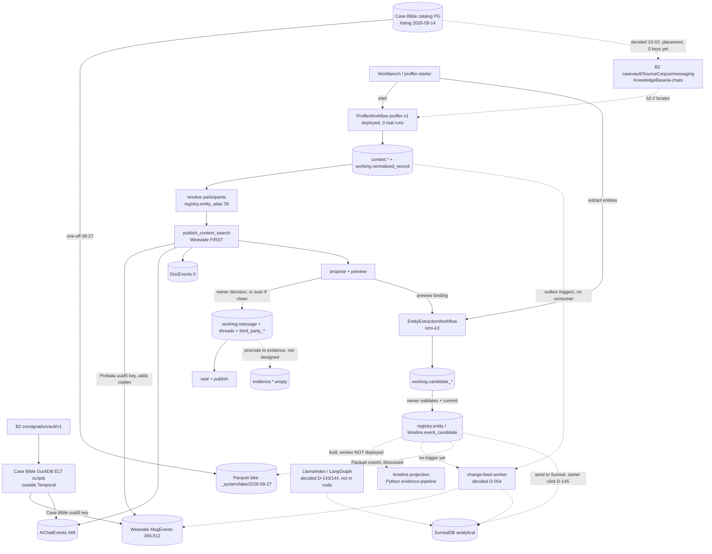

# Message flow: decided vs built vs running — 2026-10-02

> _Byline: Claude Code · Opus 5.5 · 2026-10-02. A read-only analysis by the session's flow-analysis agent: code, the decision log, Docstore, memory, session logs and live read-only queries on the platform DB, the catalog, Weaviate and Temporal. Codex's peer audit (`~/.codex/.chatgpt-projects/…/reports/2026-10-02-Propria-current-state.md`) was folded in. Owner decisions A–F below are open until he answers._

## Answer first

- **Built and deployed; never run on the real case.** The Proffer worker polls `proffer-v1`. All 47 Temporal workflows so far are test runs. Since the 10-02 purge, `working.*`, `raw.*` and `timeline.*` are empty; `registry.*` holds 2 people and 39 aliases.
- **Weaviate holds only Case Bible data.** `MsgEvents20260918` has 366,912 objects, all from the Case Bible DuckDB scripts (`elt_run.py`, `publish_bundle.py`), outside Temporal. `AiChatEvents20260918` has 446 and `DocEvents20261001` has 0.
- **Weaviate is written first (decided, built). Nothing updates it afterwards.** The change-detection outbox exists only as triggers: no sinks, no cursors, no consumer.
- **No CocoIndex, LlamaIndex or LangGraph in the message flow.** CocoIndex runs Intake and Docstore. LlamaIndex and LangGraph are decided (D-143, D-144) but not in code.
- **Timeline projection:** the step is built, but its Python worker (`evidence-pipeline`) has 0 pollers.
- **casevault is not catalogued yet:** 0 keys. The newest B2 listing in the catalog is from 2026-09-14.

## Decided (newest owner statement wins)

- **Weaviate first:**
  - 09-18 "IT ALL GOES TO WEAVIATE FIRST";
  - 09-19: Weaviate, then DuckDB extraction, then timelines, entities and graphs in Surreal;
  - OD-06, answered 10-01: reuse `MsgEvents20260918`; the stage is mandatory.
- **Extract → confirm → commit, all through Temporal** (D-161).
- **Change detection:** an outbox per table, a NOTIFY wakeup, cursors per sink and a dead-letter table (D-054; "Implement it" 09-26).
- **Entities and timeline copied at once to Surreal and Neo4j** through that outbox (09-26, spec G-08). Decided, not built.
- **Postgres canonical, Surreal a rebuildable analytical projection** (ADR-0056, D-151).
- **The lifecycle** (D-145, D-146):
  - context first;
  - "send to Surreal" is an owner click;
  - "promote to evidence" is a second click;
  - promoting straight from context is allowed.
- **LlamaIndex and LangGraph are in** (D-143, D-144): retrieval, stitching, SAT extraction and assembly into Surreal, as Temporal activities, built after ingest works end to end.
- **AI-chat context goes to Postgres first** (D-048, `working.context_record`).
- **casevault is the home root** (10-02).

## Discussed, not decided

- A Parquet or JSON route for entities and events, catalogued, with change detection in both PG and Weaviate (10-02).
- Whether other material goes to Surreal automatically or by owner click (spec C-03).
- The evidence lane ("We haven't even discussed evidence yet", 10-02).

## The flow as built (`proffer/workflow.go`)

1. Register, retain, repair assessment, handler selection (owner signal).
2. Parse → `context.raw_*`; fingerprint; byte coverage and record accounting.
3. Normalize → `working.normalized_record`; lineage and hash; verify (`:596`).
4. Resolve participants (`:646`) against `registry.entity_alias` (39 confirmed).
5. **publish_context_search → Weaviate** (`:676`).
   - It runs before the owner's review and before `working.message`.
   - Object ids are uuid5 of `probata:ctxsearch:nr:v1|<source_version_id>|…` (`contextsearch/object.go`).
   - A rerun of the same source version replaces its own objects.
   - It does not match the Case Bible's objects for the same messages, so a second copy is added.
   - There is no delete path.
6. Propose first-party → preview → owner decision → commit `working.message`, participants, threads, `third_party_*` → seal.
7. Entity and event extraction (separate workflow, started by hand or from the Review panel, kimi-k3).
   - Proposals go to `working.candidate_*`.
   - The commit writes `registry.entity*`, `timeline.event_candidate` and `timeline_member`.
8. Timeline projection: `build_timeline_generation_activity`, a Python activity on `evidence-pipeline`, which is not deployed.
9. Change detection: outbox triggers exist on 6 working tables. None exist on `working.message`, the thread tables, `registry.*` or `timeline.*`, and there is no consumer.
10. Surreal: nothing in Probata writes to it.
11. Parquet lake: `casebible/tools/lake_publish_20260927.sh` published 106 catalog tables to `consignatio/_system/lake/2026-09-27/` once, recorded in `raw_duck.lake_publish_20260927`. There is no refresh job and no Probata tables.

## Could become evidence vs always context

| | SMS, Messenger, calls, email | AI chats, notes, derived, reference |
|---|---|---|
| casevault home | `SourceCorpus/messaging`, `telephony` | `KnowledgeBase/ai-chats`, `DerivedKnowledge` |
| Weaviate | `MsgEvents` | `AiChatEvents` / `DocEvents` |
| Promotion to evidence | applies (D-145/146); lane not designed | should never apply; **nothing in code stops it** |
| Blur | — | the first-party commit has no format check, so AI turns can land in `working.message` |

## Weak points

- **Silent failures:**
  - the projection worker isn't deployed;
  - outbox rows would pile up with no consumer;
  - rejected runs stay searchable.
- **Duplication:** two writers to `MsgEvents` with two dedup schemes.
- **Single points of failure:** one Weaviate instance; NIM for every embedding.
- **Drift:**
  - the catalog listing is 18 days old;
  - casevault is uncatalogued;
  - stale prose remains (spec `:396` "no Weaviate write before approval", D-149 "no text in Weaviate", Codex's list).

## Owner decisions (default in bold)

- **A. Keep Weaviate, Surreal and Neo4j in step after a commit or edit.**
  - **(a) One Temporal-scheduled change-feed worker over the existing outbox. Add triggers on `working.message`, `registry.*` and `timeline.*`. Sinks: Weaviate (upsert, same uuid5) and Surreal; Neo4j later.**
  - (b) Rerun `publish_context_search` after each correction.
  - (c) Return to Postgres first.
- **B. Case Bible vs Proffer objects in `MsgEvents`.**
  - **(a) Keep both, filter by origin, and retire the Case Bible copy of each file once Proffer has imported it (`publish_bundle.retire_old`).**
  - (b) Proffer adopts the Case Bible key.
  - (c) Separate collection.
- **C. Extractor now.**
  - **(a) Go + kimi-k3 (built). LlamaIndex and LangGraph later, per D-144 timing.**
  - (b) Build LlamaIndex extraction now.
- **D. Timeline projection.**
  - **(a) Deploy the existing Python `evidence-pipeline` worker in Coolify.**
  - (b) Rewrite it in Go.
  - (c) Drop the Timesketch projection.
- **E. Entities, events and timeline to the catalog.**
  - **(a) Extend `lake_publish` as one Temporal activity: Parquet to casevault `DerivedKnowledge`, catalog rows recorded.**
  - (b) A JSON event log.
- **F. Keep the two kinds of material apart.**
  - **(a) AI-chat formats skip the first-party commit and never get the evidence-promotion action.**
  - (b) Shared, labelled.
- **Before any real run:** load a fresh B2 listing of `consignatio/casevault/` into the catalog.

## Flow (solid = built and running, dashed = decided or built-not-running)

